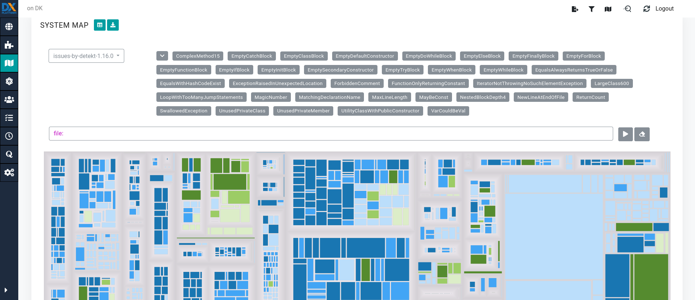

# detektDx
  **detektDx** is a converter for the output format of **detekt** to a property file compatible with **Dx-Platform**. **detektDx** uses currently **detekt v.1.16.0**.

# Features
 1. **Compability**: with Dx-Platform: based on the output of the detekt static analyzer a property file that can be understood by Dx-Platform is generated
 2. **Performance**: detektDx uses the detekt flag called **--parallel** for a better performance for most files on most machines
 3. **Portability**: by using Docker detektDx can **run on any machine** without having to try too much to respect other requirements

 # ***DESCRIPTION***
 ## TODO come back to describe the input and the output, e.g. what the values mean (some properties have a number appended to the name and some properties have values 1 or greater than 1). Add two examples.

# Requirements
 ## 1. Before trying to satisfy these requirements: where should be some of the software below?
 ***The Kotlin project that is going to be analyzed*** and ***the detektDx Docker image*** should be in the same directory **D**. The output of detektDx will be in a directory **D2** found in the same directory **D**.
 ## 2. **Docker**
 If Docker is installed and the next two files, detektDx/detekt and detektDx/dx-platform_properties, are on the same location, the Docker image [b12koe1/bogdanbc-ces-repository](https://hub.docker.com/r/b12koe1/bogdanbc-ces-repository) can be used to generate the property files.

sudo docker run -v $PWD/detekt:/detektDx/detekt -v $PWD/dx-platform_properties:/detektDx/dx-platform_properties b12koe1/bogdanbc-ces-repository bash -c "kotlin DetektDxKt detekt"
## 3. A Kotlin project for analysis
Any of the next two is all right.

### Example 1: [kotlinx.coroutines](https://github.com/Kotlin/kotlinx.coroutines)
  This could be cloned:

    git clone https://github.com/Kotlin/kotlinx.coroutines.git
### Example 2: [detekt](https://github.com/detekt/detekt)
  This could be cloned:

     git clone https://github.com/detekt/detekt.git
## 4. Dx-Platform
### Download [Dx-Platform](https://drive.google.com/file/d/1bC4ZJ_RVcGJezAHZ45AIF8UKAh3gG3NY/view)


 1. Start Dx-Platform by following the instructions from the Dx-Platform's README.md found in:

    dx-platform-2.0.0-ALPHA/.dx-platform/

 2. Create a new Dx-Platform project with the downloaded Kotlin project
 3. Check whether the Kotlin files are labeled with Kotlin. If the Kotlin files are not labeled with Kotlin add label for them, add label for the Kotlin files.

# Quick Start

 1. **Run detektDx** with the downloaded Kotlin project **KP1**
 2. **Wait** until detektDx completes its execution
 3. (***Optional***) **Check** the directory:
    `/dx-platform_properties`
    A file **F** must have been generated in this directory. This file must have the name:
    `dx_platform_properties**<start_timestamp_of_output_generation_process>**.json`
    Example:
      `dx_platform_properties20210324194753.json`
 4. **Import** this file **F** to **Dx-Platform** by following the next steps
 5. Select **Configure** the **Dx-Platform project** for the Kotlin project **KP1**
 6. Select **Upload Properties**
 7. Navigate to the tab **Upload Property Files**
 8. **Import** the generated property file in Dx-Platform by uploading the file **F**
 9. Start **Exploring** by selecting **Explore Project**
10. Navigate to **System Map**
11. In the combo box for **Code Activity** select **issues-by-detekt-1.16.0** (this is the category of all properties currently generated by detektDx.
12. Depending on the issues detected by detekt, various labels can be selected. Examples of such labels are: **MagicNumber**, **EmptyFunctionBlock**, **ComplexMethod15**. Note that some label are followed by a number. That number means that starting with the value of that number the specific issue associated with the number will be reported. For example, if the complexity of a method is >=15, then an issue ComplexMethod15 will be reported. 2 images of **System Map**, each one for a different Kotlin project, below:
```

```
```

```
# Preconditoins
 1. **detektDx** must receive ***exactly one argument***
 2. this argument must be ***exactly one relative path*** to the Kotlin project to be analyzed
# Contributors
* Bogdan Bogorodea
# Acknowledgments
  * **detekt**. **detektDx** uses **detekt** for the hard work of static analysis of Kotlin projects.
  * **Dx-Platform**. **Dx-Platform** does wonderful things with the output of **detektDx**. Without **Dx-Platform** the conversion would have not be that useful.
